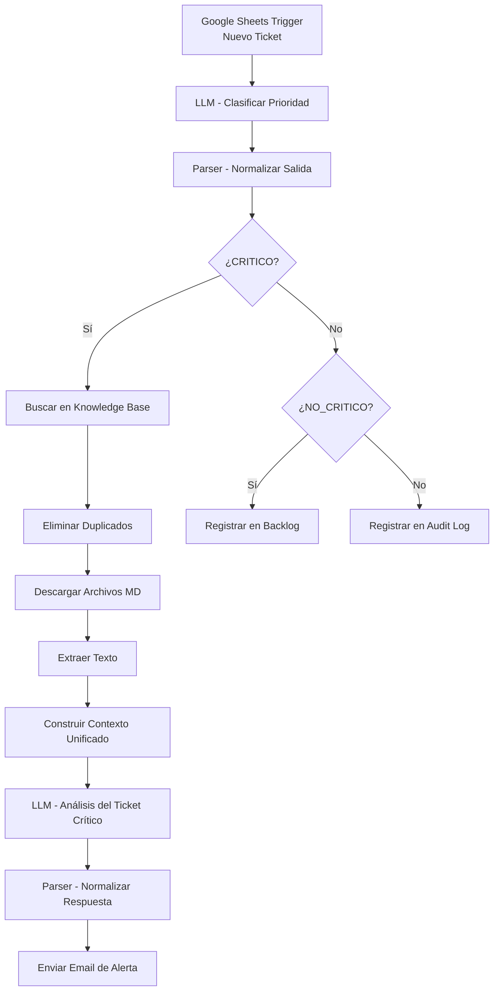
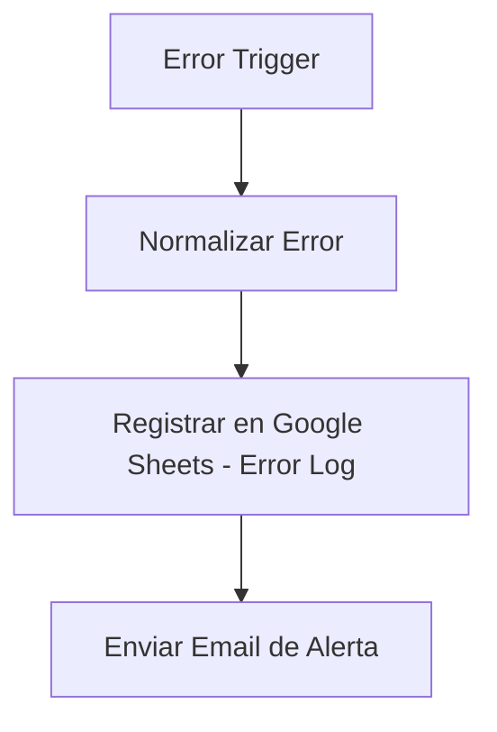

# Support Ticket Automation with AI (n8n)

## 📌 Descripción general

Este proyecto implementa una automatización empresarial para la **gestión inteligente de tickets de soporte**, utilizando **n8n** y **modelos de lenguaje (LLM)**.

El sistema clasifica automáticamente los tickets entrantes, prioriza incidentes críticos, los enriquece con una base de conocimiento interna y notifica al equipo correspondiente.  
Además, mantiene trazabilidad completa mediante logs y backlogs estructurados.

---

## 🖼️ Diagrama general del workflow

> 📍 Diagrama visual del flujo completo  

## 🖼️ Diagrama control errores en workflows

---

## 🧭 Diagrama lógico del flujo (Mermaid)

### 🛠️ Diagrama del workflow de manejo de errores

🔁 Flujo detallado

1️⃣ Ingreso de tickets

    Fuente: Google Sheets

    Evento: nueva fila agregada

    Campos clave:

        ticket_id

        cliente

        mensaje

        fecha

2️⃣ Clasificación automática con IA

    LLM analiza el contenido del ticket

    Clasifica como:

        CRITICO

        NO_CRITICO

    La salida se normaliza para evitar errores de formato o alucinaciones del modelo

3️⃣ Gestión de tickets críticos

Los tickets críticos:

    Consultan una base de conocimiento interna en archivos .md

    Se genera un análisis enriquecido con:

        Resumen ejecutivo

        Posibles causas

        Acciones sugeridas

    Se envía un email automático al equipo responsable

4️⃣ Gestión de tickets no críticos

    Se almacenan en un backlog estructurado

    Permiten atención asincrónica y planificación futura

5️⃣ Auditoría y control

    Cualquier valor inesperado del LLM se registra en un log

    Permite monitoreo, mejora continua y trazabilidad

🧠 Buenas prácticas aplicadas

    Diseño modular y escalable

    Manejo de errores del LLM

    Separación de responsabilidades

    Enfoque enterprise-ready

    Automatización basada en eventos

🚀 Tecnologías utilizadas

    n8n

    Google Sheets

    Google Drive

    Gemini (LLM)

    Markdown Knowledge Base

📎 Autor

Fernández Nicolás

Proyecto académico – Coderhouse
Automatización y Orquestación con IA
